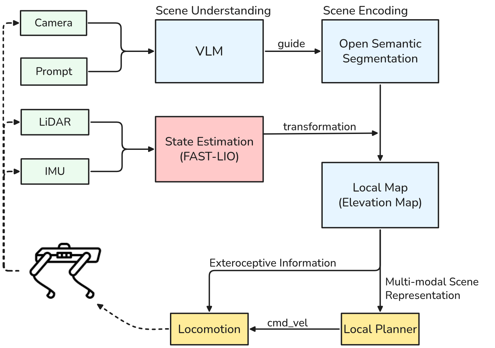

# 1. Introduction

Autonomous robotic platforms capable of operating for extended periods in wild, unstructured environments would transform how we observe and study the natural world — from habitat mapping and biodiversity survey to volcanic and wetland monitoring. Legged robots, whose mobility on rough and vegetated terrain exceeds that of wheeled or aerial platforms, are particularly well placed to serve this role [@dunbabin2012robotsenvironmentalmonitoringa]. Yet despite recent advances in locomotion [@miki2022learningrobustperceptive] and a growing body of bounded-scope field demonstrations [@tranzatto2022teamcerberuswins; @mattamala2025buildingforestinventories], legged autonomy in the wild still tends to be confined to short missions in favourable conditions; and integrated monitoring deployments that exploit this mobility remain comparatively rare and site-specific. Moreover, the monitoring payloads used in existing deployments are typically purpose-built for narrow sensing goals (e.g. tree DBH [@mattamala2025buildingforestinventories], gas sensing [@richter2026largescaleautonomousgas])—an integrated, reusable, cross-platform monitoring payload design for legged robots remains absent

This PhD investigates long-term autonomous navigation of legged robots in wild environments, framed around environmental monitoring as the driving application. The underlying thesis is pragmatic: progress on this problem is currently bounded less by any single algorithmic gap than by the *systems-level engineering and integration* required to turn short demonstrations into sustained, generalisable field capability, and to organise that capability into monitoring deployments whose design is informed by the needs of environmental science. A field-grounded treatment of both the navigation stack and the monitoring-system design space is needed to move beyond isolated success stories. The research takes UK temperate woodland as its primary field context, where dense undergrowth, seasonal variability, and existing ecological monitoring infrastructure provide both technical challenges and ecological relevance

## Research Objectives

The work is structured around three research objectives. 

**RO1: Develop a Wild Autonomous Navigation System (WANS) for Long-Term Operation on Cost-Controlled Quadruped Platforms**

- *RO1.1* Design and implement the system. 
- *RO1.2* Evaluate in progressively challenging outdoor/forest scenarios.
- *RO1.3* Characterize failure modes and operational constraints through repeated deployment.

**RO2. Develop an Integrated Monitoring Payload (IMP) for Quadruped-Based Environmental Monitoring.**

- *RO2.1* Design a modular, reproducible IMP combining multiple sensing modalities (mapping, atmospheric, soil).
- *RO2.2* Integrate IMP with WANS and validate in UK temperate woodland.
- *RO2.3* Release IMP design and deployment protocols as open-source contributions

**RO3: Systematize Field Deployment Experience into Community-Usable Knowledge and Open Artifacts**
- *RO3.1* Synthesise a field-experience reference for legged-robot wild deployment, 
  integrating own deployment lessons with prior work, and including a set of 
  deployment-grounded evaluation metrics.
- *RO3.2* Release open-source artifacts validated through this research: 
  IMP design, portable WANS components, longitudinal deployment datasets, 
  and benchmark tasks.

# 2. Literature Review

The proposal draws on three adjacent but only loosely linked bodies of work.

## 2.1 Quadruped robotics and autonomous navigation in unstructured wild environments

Recent work has advanced legged locomotion in rough terrain [@miki2022learningrobustperceptive] and learned traversability in natural environments [@mattamala2024wildvisualnavigation]. Field deployments have demonstrated autonomous forest inventory [@mattamala2025buildingforestinventories] and volcanic gas monitoring [@richter2026largescaleautonomousgas]. However, these rely on high-cost ANYmal or Spot platforms, and long-duration operation on cost-controlled quadrupeds remains underexplored. This gap is the focus of RO1. 

## 2.2 Long-term autonomous field deployment

Existing monitoring payloads for field robots tend to be purpose-built for single sensing targets—examples include LiDAR-based forest structure mapping [@mattamala2025buildingforestinventories] and mass spectrometers for volcanic gas sensing [@richter2026largescaleautonomousgas]. The foundational framing of robots for environmental monitoring [@dunbabin2012robotsenvironmentalmonitoringa] predates recent advances in learning-based locomotion, vision foundation models, and mobile LiDAR SLAM, and provides limited insight of payload integration for legged platforms. As a result, there is no established design for a modular, reusable monitoring payload that combines multiple sensing modalities (e.g., mapping, atmospheric, soil) and can be deployed across different legged platforms without per-deployment customization. Addressing this gap is the focus of RO2.

## 2.3 Autonomous systems for environmental monitoring

Evaluating long-term autonomous operation in wild environments remains an open problem [@mattamala2025buildingforestinventories]. Structured settings have developed evaluation practices—subterranean autonomy benchmarked through the DARPA SubT Challenge [@tranzatto2022teamcerberuswins], industrial long-term autonomy tracked via intervention rates and uptime [@staniaszek2025autoinspectlongtermautonomous]—but no equivalent framework exists for repeated, long-duration deployment in unstructured wild environments. Community-level recognition of this gap is reflected in recent venues such as the ICRA 2026 LOWI workshop [@icra2026workshoplowi]. Moreover, systematic synthesis of field deployment experience remains rare: lessons are typically scattered across per-paper discussion sections rather than organized into community-usable references, with @melo2023animalrobotsafrica standing as a notable exception. Addressing this evaluation and synthesis gap—through framework development, structured lessons, and benchmark release—is the focus of RO3.

# 3. Proposed Methodology

Building on the literature above, this PhD is oriented around the question:

> **How can long-term autonomous navigation of legged robots in wild environments be engineered to support integrated environmental-monitoring deployment on cost-controlled platforms?**

The methodology is organised into three technical workstreams, each linked to one or more research objectives: (3.1) Wild Autonomous Navigation System (WANS) Development; (3.2) Integrated Monitor Payload Development; (3.3) Field Deployment, "社区贡献集合包"(lesson learned collection of field robot test (mine (practice) and others (survey)), (尝试给出) a bit more general-use evaluation matrics for WANS and IMP, and opensource ).

## 3.1 WANS Development

### 3.1.1 Platform and Hardware Setup

Hardware is selected to demonstrate that WANS capability can be built on cost-controlled quadrupeds, contrasting with the ANYmal/Spot-class platforms used in most current wild deployments

**List of Hardware**
- Robot platform: Unitree Go2 / Go2-W / B2 (pending) / A2 (pending)
- Sensor Configuration: LiDAR (Livox Mid360 or equivalent) + 1~2 RGB-D Cameras (RealSense D435i or equivalent), GNSS.
- Computation: Jetson Orin AGX / Intel NUC
- Others: , Network Router, HDMI wireless graphic transmitter,  

Unitree Series is commonly indentified mid-tire platform for cost-controlled experiements; LiDAR, cameras and GNSS are fundamental sensors for perception, localization and mapping; Jetson and Intel provides external computation for running SLAM or Semantic Segmentation. Router and HDMI wireless graphic transmitter provides network access and remote control over edge computers.

### 3.1.2 System Architecture

The proposed WANS follows a modular architecture that combines multimodal perception, FAST-LIO2-based state estimation, foundation-model-based scene encoding, semantic segmentation, local map representation through elevation maps, local planning, and an RL-based locomotion policy. Rather than proposing a wholly new algorithmic stack, the emphasis is on integrating these existing components into a robust system for autonomous operation in wild environments.

{#fig:wans-arch width=100%}

## 3.2 IMP Development

### 3.2.1 Modular Payload Design

The IMP is scoped around three sensing modules: 
1.  mapping and detection, using LiDAR and RGB cameras (mounted separately); 
2.  atmospheric monitoring, using a compact gas-sensor array for gases and ambient conditions such as CO2, Oxygen, particulate matter, temperature, and humidity; 
3.  soil and substrate monitoring, using soil probes for moisture, conductivity, temperature, and pH. 

These three modalities are considered as the principal dimensions most relevant to woodland deployments. Other modalities, such as acoustic or hyperspectral sensing, are important but are treated as out of scope for the initial IMP, since they introduce additional payload, calibration, power, and interpretation complexity that would distract from the core objective of establishing a reproducible and deployable baseline payload.

### 3.2.2 Integration with WANS
- **Mechanical Layer**: each sensing unit is designed as a separable module with standardised mounting, power, and data interfaces, so that modules can be replaced without redesigning the entire payload stack. 3D-print structural supports to secure the IMP to the back of the quadruped platform, ensuring the total weight remains under 5 kg.    
- **Software Layer**: all modules expose a standardised ROS 2 interface contract, including sensor outputs, timestamps, frame definitions, calibration metadata, and health-status reporting, so that they can be logged, synchronised, and integrated consistently within the WANS
- **IMP-WANS Coordination**: the IMP collection period may require the WANS to behave accordingly. For instance, the robot needs to stop and insert soil probe, and slow down near detection zone at gas collection.

To ensure reproducibility, the IMP will be documented through open-source CAD files, bills of materials, interface specifications, and integration protocols, so that the payload can be replicated, adapted, and extended by other researchers.

## 3.3 Evaluation and Synthesis

### 3.3.1 Real-World Deployment

**Level 0: Simulation Validation (optional)** -- e.g. Gazebo or Unreal Robotics Lab [@embley-riches2026unrealroboticslab]. During the early stages of system development, modules can be debugged and integrated in a simulation environment.

**Level 1: Urban Semi-structured outdoor** -- e.g. UCL East and urban grassland. This level establishes the baseline system in an outdoor setting, where terrain variation, vegetation clutter, and perception ambiguity are limited, allowing early failures to be analysed and attributed to system integration and basic autonomy issues.

**Level 2: Wild Semi-structured outdoor** — e.g. open woodland or hill with relatively clear hiking paths. This level transits into genuinely wild environments, where canopy effects, irregular terrain, and natural visual clutter begin to challenge perception, localization and local planning. But path structure can still support progressive system debugging.

**Level 3: Dense forest** — e.g. UK temperate broadleaf woodland with dense undergrowth. This level is the target deployment scenario for RO1, where path structure maybe absent, vegetation can confuse geometric perception, and challenges system robustness against complex field conditions.
 
In system development phase, most experiments will be carried out in Level 0 and Level 1.
Once the WANS and IMP are testeed pass seperately, we will integrate both and carry out test in Level 2 and Level 3. During the loaded field test, we might see the need to adjust and improve both both systems, so as to handle unpredicted challenges brought by the dense vegitations or unstructured terrains.   

During the deployment, we will develop a structured log for the system performances (e.g. human intervention frequency, sustained deployment duration, validity of collected data on IMP), failures modes, and decisions on technical changes.  

### 3.3.2 Structured Lessons Capture & Evaluation Framework

**Contribution A: Field-Experience Synthesis**

A field-experience synthesis that integrates the deployment lessons from own and prior work into a structured community reference. This includes failure taxonomies, design-decision records, operational protocols, and a set of proposed evaluation metrics grounded in deployment practice. It is intended to accelerate subsequent field work in legged-robot wild deployments.

**Contribution B: Open-Source Artifact Release**
<!-- 社区贡献3 - 开源一些能够让大家复用的,好用的东西 -- 比如 IMP 的设计和 API, 比如如果经过验证有一定通用性的 WANS stack, 或者就是几个具体的模块. -->
Open-source release of system artifacts validated through this research: (a) the Integrated Monitoring Payload design (CAD, BOM, firmware, ROS 2 interfaces), (b) WANS components demonstrated to be portable across the evaluated platforms, and (c) longitudinal deployment datasets from UK woodland campaigns, licensed permissively for academic and industrial reuse.

# 4. Expected Contributions

1. **A prototype long-term autonomous wild-navigation system on a cost-controlled quadruped platform** (RO1.1) — deployable, instrumented, and usable by a single field operator.
2. **Empirical evidence of cross-scenario generalisation and long-duration stability** (RO1.2), established through structured field deployments across a scenario-diversity matrix.
3. **A field-grounded experiential synthesis of long-duration wild deployment** (RO1.3) — a systems-level lessons-learned account with an associated open dataset, intended as a practical reference for subsequent work.
4. **An updated design-space framework for autonomous environmental monitoring systems** (RO2.1), spanning target ecosystems, monitoring targets, platform classes, and hardware-integration constraints, developed in consultation with ecology stakeholders.
5. **Case-study validation of the framework through concrete field deployments** (RO2.2), demonstrating feasibility on a cost-controlled quadruped platform and surfacing gaps that motivate subsequent work.

# 5. Research Plan

*The schedule below is indicative. A detailed milestone-and-deliverable plan will be produced separately (Gantt chart) as the project begins.*

**Phase 1 — Baseline and stakeholder engagement.**
Consolidate the ViPlanner-based baseline (§3.1). Begin structured outdoor deployments in low-complexity wild environments (grassland, hiking trails), with systematic failure logging. Initiate literature consolidation and stakeholder engagement for the monitoring framework (§3.3).

**Phase 2 — Scenario diversification and framework maturation.**
Expand deployments to higher-complexity terrain (light-to-dense forest, wetland) and longer missions (target: up to approximately ten-hour missions). Develop targeted robustness mechanisms as the baseline's cross-scenario transfer breaks down. Mature the monitoring framework from requirements notes into a structured design-space treatment; scope the primary monitoring case in detail with the ecology collaborator.

**Phase 3 — Synthesis, integration, and first monitoring deployments.**
Consolidate the experiential synthesis (RO1.3) into publishable form together with an associated open dataset and evaluation protocol. Integrate the navigation stack with the primary monitoring case payload and carry out the first field deployments of the combined system.

**Phase 4 — Extended deployments and thesis.**
Run the longest-duration integrated deployments; where timeline permits, extend to the stretch monitoring case (gas/soil sensor integration). Write and submit the thesis.

| Year | RO1 focus                                                       | RO2 focus                                                |
|------|-----------------------------------------------------------------|----------------------------------------------------------|
| 1    | RO1.1 baseline consolidation; first low-complexity deployments  | RO2.1 initial literature and stakeholder engagement      |
| 2    | RO1.2 complex terrain; ~10-hour missions; robustness mechanisms | RO2.1 framework maturation; RO2.2 primary case scoping   |
| 3    | RO1.3 synthesis; dataset and evaluation protocol release        | RO2.2 primary case integration and first deployments     |
| 4    | Final long-duration integrated deployments; thesis              | RO2.2 stretch case (if feasible); thesis write-up        |

# References
